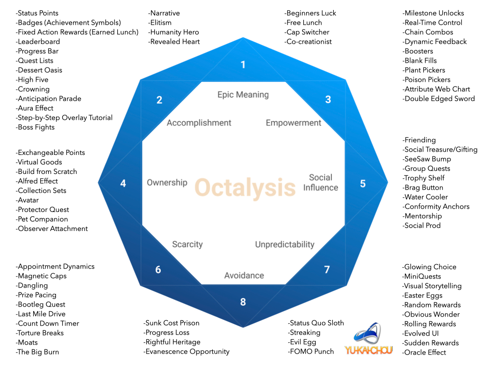

## How To Make Boring Work More Fun

- The secret to ***sustainable productivity*** is to find a way to make the thing that we're trying to do a little bit more fun.

- When we're having fun productivity takes care of itself and you don't need to worry about things like *discipline*, *grit*, *willpower*, *motivational* all that stuff to coerce ourselves into doing the things.

- There have an Idea of Gamification from the book, Actionable Gamification by Yu-Kai Chou which summarized by [Ali Abdaal](https://twitter.com/aliabdaal) the guys who tough about motivation and productivity on [YouTube](https://www.youtube.com/c/aliabdaal). This is the text about about creating games or is like making the boring things to become more fun.

- Credit by Ali Abdaal from making this video [How I Make Boring Work More Fun - Actionable Gamification](https://www.youtube.com/watch?v=ELavuz3btaE).

- We will use the Idea of Gamification to have the few principle to making things to become more fun which from the [Octalysis Framework](https://yukaichou.com/gamification-examples/octalysis-complete-gamification-framework/).

- There have 5 of the principle is white hat principle and another 2 principle consider as black hat principle which is:- 

  - White Hat Principle or Good Practice Principle

    1. Epic Meaning & Calling
    
    2. Development & Accomplishment

    3. Empowerment of Creativity & Feedback

    4. Ownership & Possession

    5. Social Influence & Relatedness

  - White Hat Principle or Good Practice Principle

    1. Scarcity
    
    2. Unpredictability & Curiosity

    3. Loss & Avoidance

*** 

## Summary of Octalysis Framework Principles

### Epic Meaning & Calling

- This is when you doing some mission or some quest or having the adventure which feels like it's part of some wider meaning or some wider purpose, that will make you do things more enjoyable and more fun.

- Like some people really enjoying to maintaining a forum or helping to creating things for the entire community. Example like [Wikipedia](https://www.wikipedia.org/) or [Open Source Projects](https://opensource.guide/).

### Development & Accomplishment
- Is like in video game having some achievements or leveling up character, it will make you feel remarkably motivating about this idea and in real live you can try incorporate to some of accomplishment into the things you doing.

- Example, to do it on real life to making the to do list and check those completed do list to make it felt like you are progressive something

### Empowerment of Creativity & Feedback

- Is to use the creativity to complete something.

- The book is explained like finding multiple ways to solve the same problem. 

- Example is you keep fighting with the same Boss and keep dying at the same time, you are keep find the ways or solution to beat the Boss and there's something incredibly motivating about the defeating the boss

- To apply this on real life is need to know:

  - How can I be more creative with this?

  - How can I get quicker feedback?

- Strategies to apply: 

  - Shorten the Feedback Loops
    - Example if we are the students, we can have some test with friends that about the course, to have a not too aggressive competition about the course, this can shorten the feedback

### Ownership & Possession

- This is what people spends a lot of time to leveling up the characters or put a lot of money to it to own the character that is strong enough to beat the boss.

- To apply this on real life that we need to know: 

  - Ownership of The Outcome 

    - Taking a little bit more responsibility, more effort, more initiative, by default because autonomy is one of the core drivers of intrinsic motivation.

  - Ownership of The Process

    - If the things didn't told you how to do it instead is you do it yourself but need to have some result, you can use this chances to train you creativity and you own autonomy to process behind the thing you're doing. 

  - Ownership of The Belief  

    - There have 2 ways to looking at the things that we have to do, we can think of 'HAVE TO' or 'GET TO'.

    - The 'HAVE TO' or 'GET TO' concept is when we do something boring, we can step back a bit and think that those thing is not 'HAVE TO' do it is I 'GET TO' do it.

### Social Influence & Relatedness

- This is when we having the game, if we have friend or social group that playing the same game, we can relate them and the game will become more fun.

- Example in real life is to bring more friend or people into the boring stuff that we're trying to make more fun.

### Scarcity

- This concept is wanting something that we don't have, like in video game, we keep grinding items that we don't have.

- This is like the game have some gear that we don't have then need to spend time on those ton's of quest and explore over the place to get that gear.

- This is how the scarcity of the people wanting that things we don't have it.

### Unpredictability & Curiosity

- This is we don't expect what will happen next.

- Is like the slot machine and gambling, there will have some unexpected that pay back sometimes we have good returns, sometimes not.

### Loss & Avoidance

- This is we fight really hard to avoid losing something. 

- This concept is like we give some amount of money to friend and told them if I don't do something then we can't get it back.
